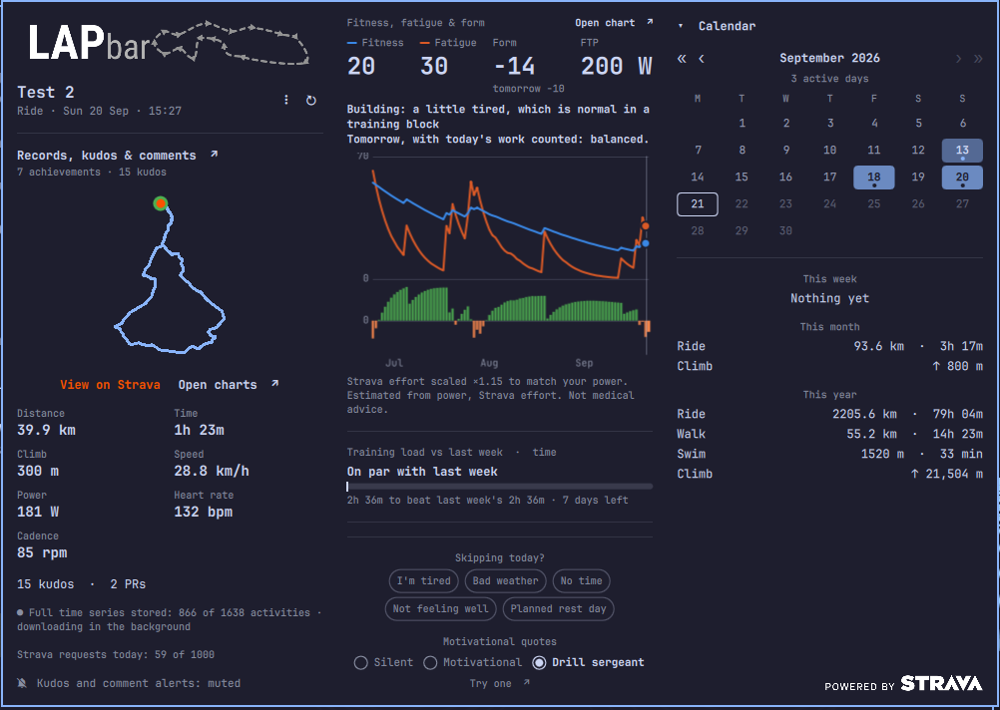
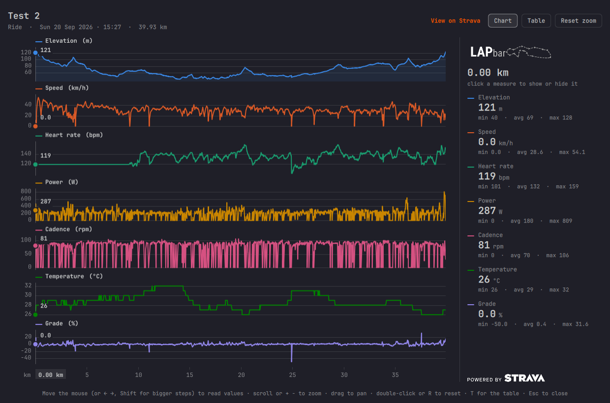
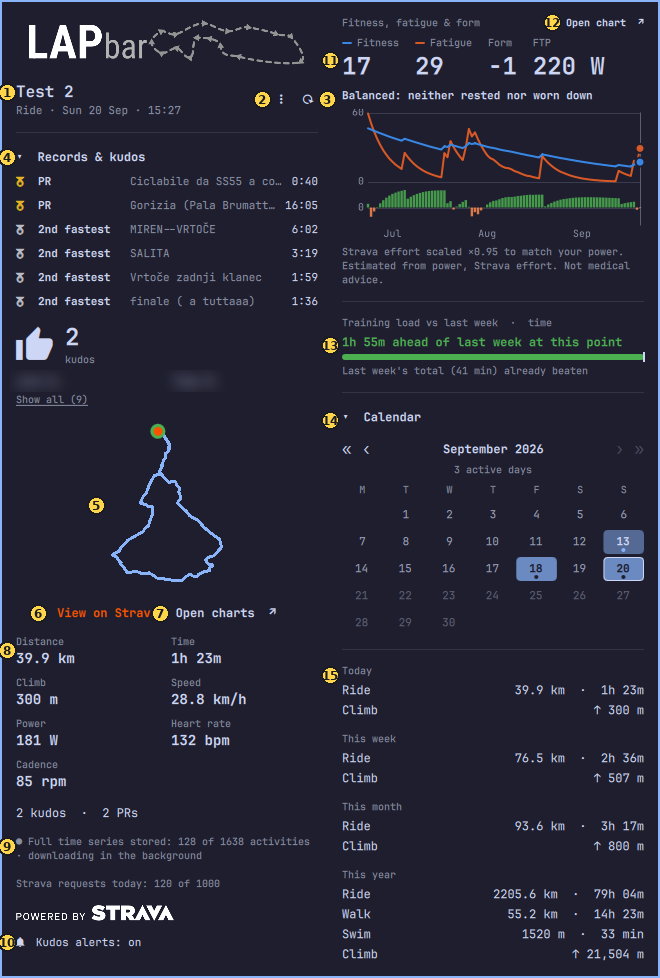
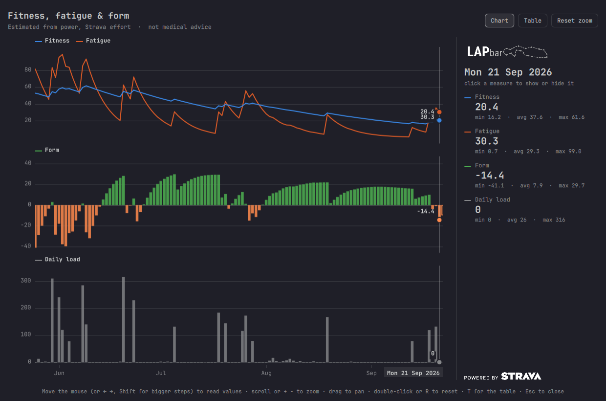
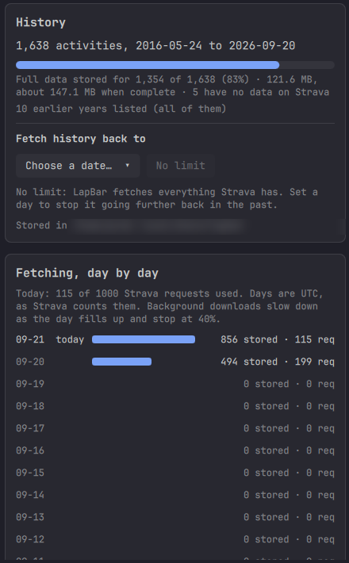
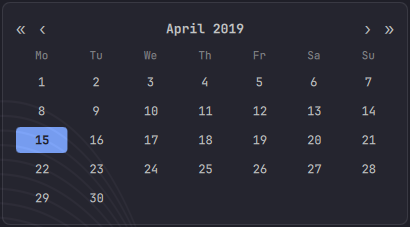

<h1 align="center">
  <picture>
    <source media="(prefers-color-scheme: dark)" srcset="assets/logo/lapbar_horiz_white.svg">
    
  </picture>
</h1>

A Quickshell status bar widget for Omarchy that shows your Strava activity in the bar: the latest activity,
totals for today, this week, this month and this year (per sport, with total climb), a route trace, kudos and
records by name, a calendar that pages back through every year you have, how this week compares with last week,
fitness, fatigue and form estimated on your own computer, and charts of every activity's time series. Your data
is stored locally, credentials stay in your system keyring, and nothing is sent anywhere but to Strava.

Not affiliated with or endorsed by Strava.

## Screenshots

  
  

*The popup for a ride (records by name, kudos, route, stats, fitness, form, calendar and totals) and the chart window
for the same ride, one plot per measure with a shared cursor. The names of the people who gave kudos are blurred.*

## Why LapBar?

**Lap** is one loop of a ride, a run or a swim. Every sport has laps, so the name is about no pace, no speed and
no single activity, and it suits cyclists, runners, swimmers and walkers alike. "One more lap" is also what LapBar
nudges you towards: it shows what you did the last time you got up and moved, and (over time) encourages you to do
it again.

**Bar** is where it lives today: the Omarchy status bar. The Strava sign-in, request budgeting and fitness
calculations run as a separate command-line tool (`lapbar`), so nothing about the name ties the project to one
desktop.

Names it deliberately is not:

- **Not "...Strava".** Strava's brand guidelines say you must not use their name in an app's name, so the
  connection is shown the way they ask instead: the "Powered by Strava" logo, and "View on Strava" links.
  LapBar is not affiliated with or endorsed by Strava.
- **Not "pace..." or "AFK...".** Earlier working names, *pacebar* and *AFKbar*, were dropped: pace leans towards
  runners (and clashed with an existing Mac app), and AFK reads as a gaming status.

It is written in lowercase (`lapbar`) for the command, the plugin id and file paths, and **LapBar** in prose.

## Getting started

About five minutes, most of it creating your Strava app.

**You need:** a Strava account **with an active subscription** (see [the subscription question](#do-i-need-a-paid-strava-subscription)),
Omarchy, and Python 3.11+ (already on Omarchy). No pip packages are required.

### 1. Install the plugin

    omarchy plugin add <repository-url> --enable

(The repository address will be added here when LapBar is published.) The bar now shows a
**LapBar: set up** button.

### 2. Run the guided setup

Click the button and choose **Start setup**. A terminal opens and walks you through everything; the same
steps are listed below in case you prefer to do it by hand. You can also run it yourself:

    ~/.config/omarchy/plugins/io.github.gskrt.lapbar/bin/lapbar setup

### 3. What the setup asks you to do

Strava does not give out a shared key. Instead, every user registers a small **private app** under their
own account, which takes about two minutes and means your data never passes through anyone else.

1. Open **https://www.strava.com/settings/api** (log in if asked).
2. Fill in the form:

   | Field | Enter |
   |---|---|
   | Application Name | `lapbar` (anything you like) |
   | Category | `Visualizer` |
   | Club | leave empty |
   | Website | `http://localhost` |
   | Application Description | `Personal status bar widget` |
   | **Authorization Callback Domain** | **`localhost`**, exactly this: no `http://`, no port |
   | Icon | Strava asks for an image. Any picture works; `assets/icon.png` in this repository is provided |

3. Click **Create**. Strava now shows your **Client ID** and **Client Secret** (click *Show*).
4. Back in the setup terminal, paste them when asked:

   | Paste this | Where | Careful |
   |---|---|---|
   | **Client ID** (a number, about 5-6 digits) | first prompt | |
   | **Client Secret** (40 letters and digits) | second prompt, typing stays hidden | **Not** the *Access Token* or *Refresh Token* shown lower on the same page: those only have `read` access, which cannot see activities. You never paste a token; step 5 (Authorize) makes the right ones and LapBar stores them in the keyring |

5. Your browser opens Strava's authorization page. Click **Authorize** and leave every permission ticked
   (LapBar needs to read your activities).
6. Done. Within a few seconds the bar shows your latest activity. If the widget is not in the bar yet:
   `omarchy plugin enable io.github.gskrt.lapbar`.

### Do I need a paid Strava subscription?

**Yes, to create the app.** Strava's own documentation says: *"A Strava subscription is a prerequisite for
creating an app."* ([Getting started](https://developers.strava.com/docs/getting-started/)). Strava's
API FAQ adds that the subscription gives you API access *"there is no additional fee"*
([FAQ](https://communityhub.strava.com/developers-knowledge-base-14/strava-api-faq-12906)), and their
announcement says Standard Tier developers *"will need a Strava subscription to keep API access"* from
30 June 2026 ([announcement](https://communityhub.strava.com/developers-api-7/new-strava-api-update-what-the-message-means-13433)).

What Strava has **not** said, as far as I can find: a price for this purpose, or what happens to an
existing single-user app if the subscription later lapses. Check Strava's pages for the current rules;
they change. LapBar itself is free and asks for nothing else.

### What the "own app" model means for you

- **The app is private to you.** A new Strava app starts in *single-player mode*: only the account that
  created it can sign in. That is exactly what LapBar needs. Two people on one computer each need their
  own app.
- **Rate limits are yours alone.** A new app gets 200 requests per 15 minutes and 2,000 per day overall
  (100 and 1,000 for reads). LapBar uses roughly 2-5 requests per refresh, every 15 minutes by default.
- **Nobody else sees your data.** LapBar talks only to `strava.com` from your own machine.

## Which Strava API calls LapBar makes

LapBar targets the **Strava API v3** (the spec's own version is 3.0.0; last compared with it on
2026-09-20) at `https://www.strava.com/api/v3`. It only **reads**: it never creates, changes or deletes anything on
Strava. It asks for the permissions `read` and `activity:read_all`. Every request it makes:

| Method | Path | What for | When |
|---|---|---|---|
| GET | `/api/v3/athlete/activities` | the activity list: totals, the calendar, the latest activity, fitness | every refresh (one request per 200 activities since 1 January), and once per older year when history is downloaded |
| GET | `/api/v3/activities/{id}` | records (PRs and top-10 places) by name, and one activity that is not in the list | once per activity that has records, and when a chart is opened for an activity that is not stored |
| GET | `/api/v3/activities/{id}/streams` | the complete second-by-second data (GPS, altitude, speed, heart rate, power, cadence, ...) | once per activity: the newest ride, the background archive, and charts you open |
| GET | `/api/v3/activities/{id}/kudos` | who gave kudos, for the notification and the popup | for the newest activities when their kudos count changes, and when you open an older ride |
| GET | `/api/v3/athlete` | to show which Strava account was signed in | during setup only |
| POST | `/oauth/token` | signing in (authorization_code) and renewing the access token (refresh_token, about every 6 hours) | at sign-in, and when the access token has expired |
| BROWSER | `/oauth/authorize` | the page where you allow LapBar to read your activities (opened in your browser, not requested by LapBar) | at sign-in |

The request allowance is tracked from the `X-ReadRateLimit-Usage` and `X-ReadRateLimit-Limit` response headers (see
"Refresh interval and Strava's request allowance"). The address, the version and this list live in one file,
`lapbar/stravaapi.py`; `lapbar api` prints them, and a test keeps that file, the code and this table in step.

Strava can change an API without changing its version number, so `scripts/check_strava_api.py` compares these calls with
Strava's published spec (they must still exist, not be deprecated, and take the parameters LapBar sends), and a monthly
GitHub workflow runs it. **Announced:** Strava's changelog (2026-06-01) says the base URL will change from
`https://www.strava.com/api/v3` to `https://api-v3.strava.com`, available from 2027-01-04. It does not say when the old address
stops working, so this is one to check as that date approaches.

## Where your data and secrets live

| What | Where | Protection |
|---|---|---|
| Client Secret, sign-in tokens | your **system keyring** (GNOME Keyring / libsecret) | encrypted by the keyring, unlocked with your login |
| ... if there is no keyring | `~/.local/state/lapbar/secrets.json` | mode 600 in a mode 700 folder; the setup tells you when this is used |
| Client ID (not secret) | `~/.config/lapbar/env` | mode 600 |
| Cached summary for the widget (this year's activities, route shapes, names of people who gave kudos) | `~/.cache/lapbar/cache.json` | mode 600 |
| Chart-ready time series (shrunk copies, rebuilt from the archive without a request) | `~/.cache/lapbar/streams/` | mode 600 in a mode 700 folder |
| **Your data, worth keeping:** the complete time series with GPS, older years, records and kudos names | `~/.local/share/lapbar/` (`raw/`, `history/`, `details/`) | mode 600 in mode 700 folders; **contains your routes**, so keep it private |

The cache can always be deleted: it is rebuilt for free. The data folder cannot be rebuilt without asking Strava
again (one request per activity), so it is not deleted by "Reset account" (`lapbar reset --all` removes it).

Secrets are never written to the cache, to logs, or to the terminal. Older plain-text files from earlier
versions are moved into the keyring automatically and then deleted. Set `LAPBAR_NO_KEYRING=1` to use the
private file instead of the keyring.

To remove everything again (credentials, sign-in, cache and downloaded charts): `lapbar reset` (add `--yes` to skip the question), then
`omarchy plugin remove io.github.gskrt.lapbar`. You can also delete the app on Strava's API settings page.

## Troubleshooting

| You see | Cause and fix |
|---|---|
| The Strava page after clicking Authorize says the redirect is invalid, or setup times out | The **Authorization Callback Domain** is not exactly `localhost`. Fix it at strava.com/settings/api |
| "Strava rejected the Client ID / Client Secret" | You pasted an *Access Token* or *Refresh Token* instead of the Client Secret, or the ID belongs to another app. Click *Show* next to **Client Secret** |
| "Missing 'activity:read_all' permission" | You unticked a box on Strava's page. Run `lapbar setup` again and leave every box ticked |
| "Port 8734 is already in use" | Another setup is still open. Close it and retry |
| "Cannot reach your keyring" | The keyring is locked or not running. Log in again (or unlock it) and refresh. `lapbar status` shows details |
| Widget stays on "set up" | Run `lapbar status` and `lapbar fetch --print` in a terminal to see the exact message |
| "rate limit" | Strava's limits were hit; LapBar keeps showing the last data and retries |

## Planned: official Strava registration

Right now everyone creates their own Strava app, which is a few extra steps. My plan is to apply to
[Strava's Developer Program](https://share.hsforms.com/1VXSwPUYqSH6IxK0y51FjHwcnkd8) once LapBar has a public
release and some real-world use, so a future version can offer a one-click *Log in with Strava* with no app
creation. I can't promise approval or timing, since that is Strava's decision, but I will keep this section
up to date, and the own-app mode described above will keep working either way.

## What the widget does

### The bar button

The button in your Omarchy bar shows one short line and changes every 6 seconds (`cycleIntervalSec`; `0` keeps it
still). It cycles through these frames, and skips any that have nothing to show:

| Frame | Looks like | What it tells you |
|---|---|---|
| Latest activity | sport icon, `39.9 km` | your latest activity's distance (its time, for sports without distance) |
| This week | calendar icon, `76.5 km` | this week's total so far |
| **Kudos and PRs** | thumbs-up `2`, medal `2` | **how many kudos and personal records your latest activity has**. Only shown when there are any. It updates on every refresh, and new kudos also raise a notification naming who gave them. |
| Load vs last week | up arrow, `1h 55m` | ahead of (up), behind (down) or on par with last week at this point |
| Form | up arrow, `Form +5` | your form today (up: fresh, down: tired) |

**Hover** for the details: when Strava was last read, the activity's name, `2 kudos · 2 PRs`, the load comparison, your
form, how many of today's Strava requests are used, and whether kudos alerts are muted or the last refresh failed.

**Mouse:** left-click opens and closes the popup, **middle-click refreshes now**, **right-click mutes or unmutes** kudos
alerts.

### The popup, and where to find things

  

1. **The ride.** Its name, sport and date. The popup shows your latest ride; after you pick another day in the calendar
   (14), a *Back to latest activity* link appears here.
2. **⋮ Menu.** Refresh now, mute kudos alerts, refresh interval, FTP, Manage data, credentials, Strava API
   settings, About, Reset account (see the table below).
3. **⟳ Refresh now.** Opening the popup also refreshes if the data is more than two minutes old.
4. **Records and kudos.** The medals (your PRs) and cups (top-10 places) of the ride, with the segment name and the time;
   below them the thumbs-up with **how many kudos** it got and who gave them. Click the header to fold it; *Show all*
   lists everything.
5. **The route.** The ride's outline, with the start marked.
6. **View on Strava** opens the activity's page on Strava in your browser.
7. **Open charts ↗** opens the chart window for this ride: elevation, speed, heart rate, power, cadence, temperature
   and grade (see "Charts window").
8. **The ride's numbers.** Distance, time, climb, speed (or pace), power, heart rate and cadence: only what exists for
   the sport. Just below, `2 kudos · 2 PRs` is the same count the bar button shows.
9. **Storage and requests.** How many of your activities have their full data stored on this computer, and how many of
   Strava's 1,000 daily requests are used today. The *Powered by Strava* logo is required by Strava.
10. **Kudos alerts.** On or muted; click to switch.
11. **Fitness, fatigue and form:** three numbers, your FTP if set, a plain-words status and the plot. Hover any day.
12. **Open chart ↗** opens the full-size fitness chart (see "Fitness, fatigue and form").
13. **Training load versus last week.** A bar showing how this week so far compares with last week up to the same moment.
14. **Calendar.** Days are shaded by how long you were active, and a dot marks days whose full data is stored.
    Click a day to show that ride in the popup. « » move by a year, ‹ › by a month; the triangle folds it.
15. **Totals** for today, this week, this month and this year, per sport, with the total climb.

**I want to...**

| I want to | Where |
|---|---|
| see how many **kudos and PRs** my latest ride got | the bar button's thumbs-up and medal frame (or its tooltip); in the popup, 4 and 8 |
| see who gave kudos, and which records I set | Records and kudos (4) |
| be told about new kudos | automatic; mute with 10, a right-click on the bar button or **⋮ → Mute kudos alerts**; Omarchy's do-not-disturb silences them too |
| refresh now | ⟳ (3), **⋮ → Refresh now**, or a middle-click on the bar button |
| change how often it refreshes | **⋮ → Refresh every…** (1 minute to 1 hour; default 15 minutes) |
| look at an older ride | the calendar (14); *Back to latest activity* (1) returns |
| open a ride's charts, or the ride on Strava | *Open charts* (7), *View on Strava* (6) |
| see my fitness, fatigue and form | the block at the top of the right column (11), *Open chart* (12) |
| set or estimate my FTP | **⋮ → FTP…** |
| see how much history is stored, or limit how far back it goes | **⋮ → Manage data…** (see "The data window") |
| sign in again, or change the Client ID and Secret | **⋮ → Update credentials or sign in…** |
| open my Strava API application's settings | **⋮ → Open Strava API settings** |
| the credits and the project's page | **⋮ → About LapBar** |
| remove my credentials, sign-in and cache | **⋮ → Reset account…** (asks first; your downloaded activities stay unless you run `lapbar reset --all`) |

**Widget settings** (Omarchy's bar settings for this widget, or `omarchy bar set io.github.gskrt.lapbar <key> <value>
--json`): `refreshIntervalSec` (60 to 3600, default 900; also in the menu), `cycleIntervalSec` (0 to 60, default 6),
`loadMetric` (`time`, `distance` or `effort`), `downloadHistory` (0 to 30, default 12: how many older activities are
stored per refresh), `ftp` (0 to 600; also in the menu) and `historyYears` (0 to 99, default 99).

### More about what it does

- **Calendar history.** The calendar pages back to your first Strava activity, with « » to jump a year. Earlier
  years are downloaded once (one request per 200 activities of that year; a couple of years per refresh, so the
  first sync never touches the request allowance) and stored under `~/.local/share/lapbar/history/`. The
  `historyYears` setting says how many years back to keep: `0` is this year only, `99` (default) is everything
  Strava has. A stored year is not downloaded again, so later edits on Strava do not reach it; to redo them run
  `lapbar history --sync --refresh`. Clicking an older day opens that ride like any other.
- **Full data, kept for you.** LapBar stores the complete second-by-second data of every activity (GPS
  position, altitude, speed, heart rate, power, cadence, temperature, grade), compressed, in
  `~/.local/share/lapbar/raw/<year>/<activity id>.json.gz` (about 60 KB per hour of activity; `LAPBAR_DATA_DIR`
  moves it). The newest ride is stored automatically and older ones in the background, newest first, a few per
  refresh: the number set by `downloadHistory` is scaled down as the day's request allowance fills up and stops at
  40% of it. A dot in the calendar marks days with a stored ride, and a line under the totals shows how far it
  has got. `lapbar archive --limit 100` does a batch right now. Your charts are built from these files, so they
  never need a second download. This folder is yours and is not a cache: "Reset account" leaves it alone
  (`lapbar reset --all` removes it too).
- **Records and kudos** sit right under the ride's description, in a section that folds like the calendar (it
  starts folded when the list is long, so the popup never outgrows the screen). A **medal** marks a personal record
  (PR: your 1st, 2nd or 3rd fastest time on a segment, or a run's best efforts such as your fastest 5k), a **cup** a
  top-10 place among everyone on a segment (1st is the KOM/QOM), each with the segment's name and the time it was
  achieved in. Below that is who gave **kudos**, as Strava names them: first name and last initial, which is all
  Strava's API returns for other people. Everything is fetched once per ride (two requests at most) and stored, and
  for rides other than the latest only when you look at them.
- **Training load** compares this week so far with last week *up to the same moment of the week*, and shows
  what is still needed to beat last week's total. `loadMetric` chooses the measure: `time` (default, works for
  every sport), `distance`, or `effort` (Strava's Relative Effort; needs a heart-rate device, falls back to time).
- **Kudos notifications** are sent after a refresh finds new kudos, as a cup-icon notification naming who gave
  them (Strava returns first name and last initial). Only the 10 newest activities are watched; the first run
  only records a baseline. The names are kept in the local cache (`kudoers`) and never leave your machine.
- **Do not disturb:** notifications go through the shell's notification service, so Omarchy's own do-not-disturb
  silences them. A lapbar-only mute is under "Kudos alerts" in the popup, or right-click the bar button
  (`lapbar mute on|off|toggle|status`). While muted, events are consumed without notifying.

Kudos are checked on each refresh (default 15 minutes), so an alert can arrive up to that much later.

### Fitness, fatigue and form

At the top of the popup's right column is the plot everything else is meant to be built on: **fitness** (a slow
average of your training, about six weeks), **fatigue** (a fast average, about a week) and **form** (fitness minus
fatigue as it stood yesterday: above zero you are fresh, below zero you are tired). Hover any day to read it, or
click **Open chart** for the full-size version with the daily load underneath. The bar cycles a "Form +8" frame too.

  

**Using the chart.** Click **Open chart ↗** above the plot in the popup (or run `lapbar fitness`). It opens from the
activities already fetched, so it costs no request to Strava.

- **Top:** fitness (blue, slow) and fatigue (orange, fast) on one axis. Every hard day makes fatigue jump and it drops
  back within about a week, while fitness climbs slowly with regular riding and falls slowly when you stop.
- **Middle:** form as bars: green above zero means fresh, orange below zero means tired.
- **Bottom:** the load of each day, one bar per day.
- **Right:** the values for the day under the cursor, and the minimum, average and maximum of what is on screen. Click
  a name to hide that measure.
- **Reading a day:** the vertical line is the day being read, starting on today. Move the mouse or press ← and →
  (Shift for bigger steps). Scroll or press + and − to zoom, drag to pan, double-click or press R to reset, **T** for a
  table of every day, **Esc** to close (the same controls as the ride chart, see "Charts window").

What today's **form** number means, as the popup words it:

| Form | The popup says |
|---|---|
| 20 or more | Very fresh: rested and ready for a hard effort |
| 5 to 20 | Fresh: a good time for a quality session |
| -10 to 5 | Balanced: neither rested nor worn down |
| -30 to -10 | Building: a little tired, which is normal in a training block |
| below -30 | Very tired: an easy day or a rest day would help |

(Until your fitness passes 10 it says "Just getting started" instead, because a few weeks of activity are needed before
the numbers mean much.) These are guides, not rules: form is a picture of your recent load and says nothing about
how you feel, sleep, illness or injury.

Strava's API has **no** fitness or freshness data (I checked its public spec), so LapBar works it out itself with the
standard impulse-response model, from activities it has already fetched. Each activity needs one number, its
*load*, taken from the best data available:

| Load from | When | Notes |
|---|---|---|
| **Power** | you set your FTP and the ride has a power meter | TSS = hours x (weighted watts / FTP)^2 x 100 |
| **Strava's Relative Effort** | Strava recorded one (a heart-rate device) | used as is, or rescaled to match power (below) |
| **Duration** | nothing else exists | hours x a modest typical rate for the sport, so every activity counts |

TSS and Relative Effort are on different scales (one ride can be 76 TSS and 164 effort). When you set an FTP,
LapBar compares your own rides that have both and rescales effort-only activities to match, and says so under the
plot ("Strava effort scaled x0.74 to match your power"). The result is an **estimate**: good for the shape of
your training and for comparing yourself with yourself, not for comparing with anyone else's chart. The first six
weeks of history are marked as warming up. It is **not medical advice**.

**FTP.** Strava does not give it to LapBar with the permissions it asks for, so you set it yourself: **⋮ → FTP …**
(a stepper, in watts; 0 means unknown), or the `ftp` setting. It then appears as a large number next to fitness,
fatigue and form.

*How "Estimate from my rides" works.* FTP is roughly the power you can hold for an hour, and a hard ride of about
that length has a weighted (normalised) power close to it. So LapBar:

1. takes your rides from the history it has already fetched (at least the last 130 days, or since 1 January if
   that is longer; virtual rides count; e-bike rides and other sports do not),
2. keeps those with **power data** and a **moving time of 40 minutes or more** (shorter rides say little about an
   hour, and Strava's weighted power for them runs high),
3. needs **at least five** such rides, so one lucky ride or a glitching power meter cannot decide it,
4. takes the **highest weighted power** among them and rounds it to the nearest 5 W.

That is all: no extra requests to Strava, and no curve fitting. It is a conservative ballpark, usually a little
under a proper test, because not every long ride is an all-out effort. The best-20-minute-power method (95% of it)
needs each ride's second-by-second data, which does not fit the request allowance across dozens of rides. Clicking
the button sets your FTP to the estimate and recalculates at once; use the stepper (or **Clear FTP**) to change it
afterwards. The estimate is never applied on its own, only when you click.

### The data window

  
  &nbsp;
  

Open it from **⋮ → Manage data…** in the popup (or run `lapbar manage`); **Esc** closes it. It shows what LapBar has
stored and how fetching is going, and updates itself every couple of seconds while it is open.

**History.**
- The top line is how many activities you have on Strava and the dates they cover.
- The bar shows how many of them have their *full data* (every second, GPS included) stored on this computer, with the
  size on disk and an estimate of the total when it is complete. LapBar downloads them in the background, a few per
  refresh, so the bar fills over days.
- "Earlier years listed" is how many previous years' activity lists have been downloaded for the calendar.

**Limiting how far back it goes** (optional; by default LapBar fetches everything Strava has):
1. Click **Choose a date…**. A calendar opens under the button.
2. Use « and » to move by a year and ‹ and › by a month. Days before your first activity and after today are
   greyed out.
3. Click a day. It is saved at once and the button reads *From 2019-04-15*.

From then on, activities before that day are not downloaded and are hidden from the popup's calendar; what is
already stored stays on disk. **No limit** removes it. From a terminal:
`lapbar prefs --history-from 2019-04-15` (or `none`); it is saved in `~/.config/lapbar/prefs.json`.

**Fetching, day by day.** One row for each of the last 14 days (UTC, the day Strava's allowance resets on): the bar and
"stored" are the activities whose full data was downloaded that day, and "req" is the most requests Strava reported that
day (everything the widget asked, not only those downloads). The text above the rows says how much of today's 1,000
requests is used. Background downloads slow down as the day fills up and stop at 40%, so refreshing and opening charts
always have room. To download faster while you are not using Strava's allowance for anything else, run
`lapbar archive --limit 100`. `lapbar manage --status` prints everything the window shows, as JSON.

### Refresh interval and Strava's request allowance

Change how often LapBar asks Strava from the menu: **⋮ → Refresh every …** (1 minute to 1 hour, default 15
minutes). It is also the `refreshIntervalSec` setting.

A new Strava app is allowed about **1,000 read requests a day** (100 per 15 minutes). LapBar reads Strava's own
usage counters from every response, so it always knows how much is left, and it shares that out so a short
interval can never use it all up:

| What | Allowed until | Why |
|---|---|---|
| Extras: downloading older activities' charts, looking up who gave old kudos | 40% used | never worth spending scarce requests on |
| **Automatic** refreshes (the timer) | 60% used | leaves 40% of the day for you |
| **Manual** refreshes (refresh button, menu, opening the popup) | 90% used | there is always room to refresh by hand |
| Downloading the charts of an activity you opened | 95% used | you asked for it by name; stored charts always open |

When the timer is paused, the popup says so and manual refreshing still works. The counters reset at midnight
UTC (daily) and on the quarter hour. The menu lists the estimated requests per day for each interval and marks in
orange the ones where the timer alone would reach the 60% line before the day ends.

### Charts window

Click **Open charts** under the route in the popup (it works for any activity you have selected, including
older ones picked from the calendar). A separate window opens with **one plot per measure, all sharing one
x axis in kilometres**: elevation, speed (or pace for running, walking and swimming), heart rate, power,
cadence, temperature and grade, whichever the activity recorded. It is its own process, so a problem in the
charts can never affect the bar.

- **Read values at any km.** A single vertical line runs across every plot at the same distance, each plot
  marks its value there, and the panel on the right lists every measure at that km with min / avg / max of
  what is in view. Move the mouse, or use the arrow keys (Shift for bigger steps, Home / End for the ends).
- **Browse.** Scroll or `+` `-` to zoom around the pointer, drag to pan, double-click or `R` to reset.
  Click a measure in the panel to hide or show it. `T` (or the Table button) switches to a table of every
  stored value, and clicking a row moves the line there.
- **No map** (yet). Indoor activities and ones without distance use elapsed time as the x axis instead.
- Colours follow your bar theme; each measure always keeps its own colour.

Time series are downloaded **once**. The full answer from Strava (GPS included) is kept in
`~/.local/share/lapbar/raw/` and a shrunk copy for the charts in `~/.cache/lapbar/streams/` (about 60 KB per
hour of activity in the archive). Reopening a chart never asks Strava again, and if the chart copy is deleted it is
rebuilt from the archive. The newest ride is fetched automatically; older activities are added in the background
(`downloadHistory` per refresh, scaled down as the day's allowance fills up; 0 turns it off; charts you open are
downloaded on demand either way). Each download is one Strava request. Chart copies are made again, without
any request, if a later version changes how they are processed.

## Summary shape

    {
      "provider": "strava",
      "updated": "2026-09-19T12:00:00Z",
      "latest": { ...see below... },
      "week": {"distance_km": 0.0, "elevation_m": 0, "moving_time_s": 0, "count": 0,
               "by_sport": {"ride": {"distance_km": 0.0, "elevation_m": 0, "moving_time_s": 0, "count": 0}}},
      "year": { same shape as week },
      "load": {"this_week": {"moving_time_s": 0, "distance_km": 0.0, "effort": 0}, "last_week": {...},
               "last_week_same_point": {...}, "days_left": 2, "has_effort": true},
      "kudos_seen": {"<activity id>": 3}, "kudoers": {"<activity id>": ["Ana K.", "Bo M."]},
      "kudos_events": [{"activity_id": 1, "name": "...", "count": 1, "total": 3, "from": ["Ana K."]}],
      "days": {"2026-09-18": {"count": 1, "distance_km": 36.54, "moving_time_s": 4409, "families": ["ride"]}},
      "activities": [ {same fields as latest, minus nulls, route of 60 points, no elevation_profile}, ... ]
    }

`days` (active days this year, keyed by local date) drives the calendar shading; `activities` (newest
first) lets a click on a calendar day show that activity's details in the popup.

`by_sport` is keyed by sport family (`ride`, `run`, `walk`, `swim`, `paddle`, `winter`, `skate`,
`gym`, `other`), most time spent first. Unknown Strava sport types land in `other`.

`latest` (fields the activity doesn't have are `null`, never invented):

| Group | Fields |
|---|---|
| Identity | `id`, `start`, `sport` (exact Strava type), `family`, `name`, `device`, `indoor`, `commute`, `athletes` |
| Size | `distance_km`, `elevation_m`, `moving_time_s`, `elapsed_time_s`, `elev_high_m`, `elev_low_m` |
| Speed | `avg_speed_kmh`, `max_speed_kmh`, and `pace_s` + `pace_unit` (`km` for run/walk/hike, `100m` for swim, `500m` for rowing; `null` for other sports, so show speed) |
| Body | `avg_heartrate`, `max_heartrate`, `suffer_score` |
| Power | `avg_watts`, `max_watts`, `weighted_watts`, `kilojoules` |
| Cadence | `avg_cadence` + `cadence_unit` (`rpm` cycling; `spm` running/walking, doubled because Strava stores it per leg) |
| Other | `avg_temp_c` |
| Social | `kudos`, `comments`, `prs`, `achievements`, `photos` |
| Graphics | `route` (about 150 `[x, y]` points in a 0-1 square: the bare shape, no coordinates), `elevation_profile` (100 metres values evenly spaced by distance; costs one extra request per new activity) |

The widget decides what to show from `family`: pace for runners and swimmers, speed and watts for
riders, duration only for gym sessions.

## Development

    scripts/dev-sync.sh          # copy the repo into ~/.config/omarchy/plugins/ as a real folder
    scripts/dev-sync.sh --watch  # ...and again on every change

Do not symlink the repo into the plugins directory: the shell does not reload symlinked plugins.

Tests never touch your real keyring: an autouse fixture replaces it with an in-memory fake, and any attempt
to run the real `secret-tool` fails the test. Run them with a venv that has `pytest`.

### Trying the chart window without the bar

    lapbar charts <activity id>          # downloads once if needed, then opens the window
    lapbar streams <activity id> --refresh   # download the series again
    lapbar details <activity id>         # the ride's records and kudos names, as the popup asks for them (JSON)
    lapbar archive --limit 100           # store the full data (with GPS) of 100 more activities now
    lapbar manage                        # the data window: history stored, fetching by day, the date limit
    lapbar history --sync                # download the older years for the calendar now (--refresh: again, --years N)

Its plotting logic lives in `charts/logic.js` (ticks, cursor lookup, zoom, formatting) and is unit-tested with
`node`; the window itself is `charts/shell.qml` + `charts/SeriesPanel.qml`, drawn with Qt Quick's built-in
`Canvas`, so it needs no plotting library. On Hyprland 0.55+ the window is floated and centred through the Lua
API (`hyprctl eval`); older versions use the classic dispatchers.

## Notes for widget authors

- Never declare a property called `data` on an Item: it is the built-in default property that holds the
  item's children, and assigning to it silently removes them.
- After any change to `Panel.qml` or `manifest.json`, run `omarchy restart shell`. The shell logs
  "Local plugin changed, reloading" but keeps showing the old code of a widget already mounted in the bar.

## Thanks and attribution

**Powered by Strava.** LapBar exists because Strava offers an open API, and I am grateful for it. The popup
and the chart window carry Strava's official "Powered by Strava" logo, and every activity links back with "View
on Strava", as Strava's [brand guidelines](https://developers.strava.com/guidelines/) ask. The logos in
`assets/strava/` are Strava's trademarks, used unmodified and **not** covered by LapBar's license (see the
notice next to them). LapBar is not affiliated with or endorsed by Strava.

**stravalib.** Thank you to the developers of [stravalib](https://github.com/stravalib/stravalib), the
open-source Python client for Strava's API (Apache-2.0, maintained by the stravalib community). LapBar does
not use it: it talks to the API directly with only Python's standard library, so there is nothing to install.
But if you are building your own Strava tools in Python, stravalib is the place to start, and its docs are a
good way to learn what the API offers.

**Omarchy and Quickshell.** LapBar is a small plugin running on two open-source projects it could not exist
without.

## License and contributing

LapBar is free software, licensed under the **GNU General Public License v3.0 or later** (see `LICENSE`).
You can use, study, change and share it. If you distribute a modified version, you must make its source
available under the same license, so improvements stay open for everyone.

The best way to get a change to everyone, including the people who use the original, is to send it back as a
pull request. See [CONTRIBUTING.md](CONTRIBUTING.md) for how to set up, what a good pull request looks like, and
the sign-off (`git commit -s`) that goes with contributions. Security-relevant reports go through
[SECURITY.md](SECURITY.md). Sports other than cycling are first-class here: if a number or panel looks wrong
for running, swimming or anything else, that is a bug worth reporting.

## Status

Done: guided setup with keyring storage; the Strava provider for all sports; the bar widget (bar button and tooltip,
popup with stats, records and kudos by name, calendar with all your history, totals, load versus last week, fitness
and form, FTP with an estimate from your rides); a chart window for every activity; a local archive of the complete
time series (GPS included) filled in the background within Strava's request allowance; the data window (history
stored, date limit, fetching by day); a test suite.

Next: a week of testing as a user, then publish the repository and apply to Strava's Developer Program for
one-click sign-in. See `TODO.md`.
