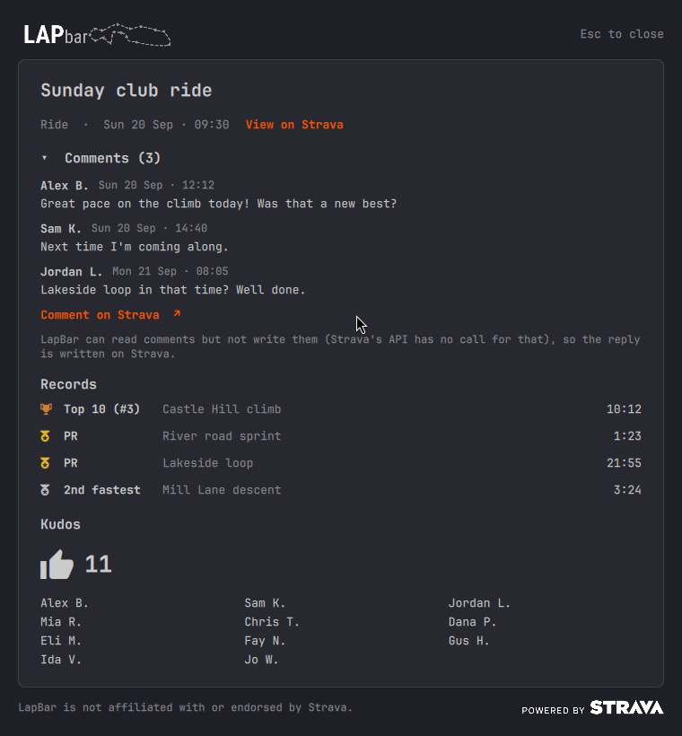

# How to use LapBar

LapBar shows your Strava activity in the Omarchy bar. This page is inside the app: open it any time from the popup's
menu (the three dots), **How to use...**

## The bar button

The button in your bar shows one short line and changes every 6 seconds. Frames with nothing to show are skipped.

| Frame | Looks like | What it tells you |
|---|---|---|
| Latest activity | sport icon, 39.9 km | your latest activity's distance (its time, for sports without distance) |
| This week | calendar icon, 76.5 km | this week's total so far |
| **Kudos and PRs** | thumbs-up 2, medal 2 | **how many kudos and personal records your latest activity has**. Shown only when there are any. It updates on every refresh, and new kudos also raise a notification naming who gave them. |
| Load vs last week | up arrow, 1h 55m | ahead of, behind or on par with last week at this point |
| Form | up arrow, Form -1 → -14 | your form today and, with today's work counted, tomorrow's |

**Hover** the button for details: when Strava was last read, the activity's name, its kudos and PRs, the load
comparison, your form, and how many of today's Strava requests are used.

**Mouse:** left-click opens and closes the popup, **middle-click refreshes now**, **right-click mutes or unmutes**
kudos alerts.

## The popup

Click the button. Each numbered part is explained below the picture.

1. **The ride.** Its name, sport and date. After you pick another day in the calendar (16), a *Back to latest
   activity* link appears here.
2. **The menu** (three dots): refresh, mute, refresh interval, FTP, Manage data, How to use, credentials, About, Reset.
3. **Refresh now.** Opening the popup also refreshes if the data is more than two minutes old.
4. **Records, kudos & comments.** One line with the counts. Click it to open the details window (see below).
5. **The route.** The ride's outline, with the start marked.
6. **View on Strava** opens the activity's page in your browser.
7. **Open charts** opens the chart window for this ride.
8. **The ride's numbers.** Distance, time, climb, speed (or pace), power, heart rate and cadence: only what exists for
   the sport. Just below, "2 kudos, 2 PRs" is the same count the bar button shows.
9. **Storage and requests.** How many of your activities have their full data stored on this computer, and how many of
   Strava's 1,000 daily requests are used today.
10. **Kudos and comment alerts.** On or muted; click to switch.
11. **Fitness, fatigue and form.** Three numbers, your FTP if set, a plain-words status and the plot. Hover any day.
12. **Open chart** opens the full-size fitness chart.
13. **Training load versus last week.** How this week so far compares with last week up to the same moment.
14. **Skipping today?** Five buttons (I'm tired, Bad weather, No time, Not feeling well, Planned rest day). The one
    you pick is marked on the calendar (16), and the coach leaves you alone that day.
15. **Motivational quotes.** Silent, Motivational or Drill sergeant, and *Try one* for a sample.
16. **Calendar.** Days are shaded by how long you were active, and a dot marks days whose full data is stored. A ring
    marks a day you skipped (hover it to see why). Click a day to show that ride. The double arrows move by a year,
    the single ones by a month; the triangle folds it.
17. **Totals** for today, this week, this month and this year, per sport, with the total climb.
18. **Powered by Strava**, in the bottom-right corner.

## Where do I find...

| I want to | Where |
|---|---|
| see how many **kudos and PRs** my latest ride got | the bar button's thumbs-up and medal frame (or its tooltip); in the popup, 4 and 8 |
| read the comments, see who gave kudos, and which records I set | Records, kudos & comments (4) |
| be told about new kudos and comments | automatic; mute with 10, a right-click on the bar button, or the menu; Omarchy's do-not-disturb silences them too |
| refresh now | the refresh button (3), the menu, or a middle-click on the bar button |
| change how often it refreshes | menu, **Refresh every...** (1 minute to 1 hour; default 15 minutes) |
| look at an older ride | the calendar (16); *Back to latest activity* (1) returns |
| open a ride's charts, or the ride on Strava | *Open charts* (7), *View on Strava* (6) |
| see my fitness, fatigue and form | the top of the middle column (11), *Open chart* (12) |
| skip a day, with a reason | the buttons under the fitness plot (14); the day is ringed on the calendar (16) |
| turn the motivational popups on or off, or change their tone | Motivational quotes (15) |
| set or estimate my FTP | menu, **FTP...** |
| see how much history is stored, or limit how far back it goes | menu, **Manage data...** |
| sign in again, or change the Client ID and Secret | menu, **Update credentials or sign in...** |
| open my Strava API application's settings | menu, **Open Strava API settings** |
| the credits and the project's page | menu, **About LapBar** |
| remove my credentials, sign-in and cache | menu, **Reset account...** (asks first; your downloaded activities stay) |

## Motivational quotes and skipping a day

In the middle column of the popup, **Motivational quotes** has three choices: **Silent** (the default), **Motivational**
and **Drill sergeant**. Pick one and LapBar sends you a desktop popup now and then, when your data says it makes
sense: several days without a ride, your form falling, or a comeback after a long break. The motivational voice is
mellow (a walk, an easy spin, a stretch). The drill sergeant shouts at your chair and never at you. **Try one** shows a
sample.

It has some sense: no popups on a recovery week or when your form is already low, none during quiet hours (22:00 to
08:00), and never more than a few a day.

Not today? In the middle column, tap **I'm tired**, **Bad weather**, **No time**, **Not feeling well** or **Planned rest
day**. The day gets a ring on the calendar (hover it to see the reason) and the coach leaves you alone for it. The
nudge itself has no buttons on Omarchy (its notifications do not draw them), so skip from here.

## Comments, records and kudos

Click **Records, kudos & comments** in the popup (4) to open the details window.

- **Comments** come first: who wrote what, and when. Click the title to fold them. *Comment on Strava* below them
  opens the activity on Strava. LapBar can read comments but not write them (Strava's API has no call to post
  one), so a reply is written on Strava.
- **Records:** a medal for a personal record, a cup for a top-10 place, with the segment and the time.
- **Kudos:** the count and who gave them, as Strava names people (first name, last initial).

When a new comment or kudos arrives, a popup says who it is from and what it says, about one activity each (two
activities give two popups). Each ends with an orange *View on Strava* link; click the popup to open that activity. Your own replies are not announced, and the "Kudos and comment alerts" switch (10) mutes both.

## Fitness, fatigue and form

Open it with *Open chart* above the fitness plot in the popup.

- **Top:** fitness (blue, slow, about six weeks) and fatigue (orange, fast, about a week) on one axis. Every hard day
  makes fatigue jump and it drops back within about a week, while fitness climbs slowly with regular riding.
- **Middle:** form, fitness minus fatigue as it stood yesterday. Green bars (above zero) mean fresh, orange bars (below
  zero) mean tired. The last bar, drawn as an outline, is tomorrow's form with today's work counted.
- **Bottom:** the load of each day.
- **Right:** the values for the day under the cursor. Click a name to hide that measure.
- **Controls:** move the mouse or press the left and right arrows (Shift for bigger steps); scroll or press plus and
  minus to zoom; drag to pan; double-click or R to reset; T for a table of every day; Esc to close.

What today's form number means:

| Form | The popup says |
|---|---|
| 20 or more | Very fresh: rested and ready for a hard effort |
| 5 to 20 | Fresh: a good time for a quality session |
| -10 to 5 | Balanced: neither rested nor worn down |
| -30 to -10 | Building: a little tired, which is normal in a training block |
| below -30 | Very tired: an easy day or a rest day would help |

These are estimates worked out on your computer from your own activities, and guides rather than rules. They say
nothing about how you feel, sleep, illness or injury. **Not medical advice.**

**FTP:** set it in the menu (**FTP...**), or press **Estimate from my rides** there. Power-based load then makes the
numbers more accurate.

## A ride's charts

*Open charts* (7) shows one plot per measure with a shared cursor and the values on the right.

The controls are the same as for the fitness chart: move the mouse or the arrow keys, scroll to zoom, drag to pan,
double-click or R to reset, T for the table, Esc to close.

The plots draw the samples your device recorded, never averages. On a long ride zoomed out, each pixel column shows its
first, lowest, highest and last sample, so no spike or dropout disappears; zoom in far enough and every sample is drawn.

## The data window

Menu, **Manage data...** shows what LapBar has stored and how fetching is going.

- **History:** how many activities you have on Strava, and how many have their full data stored here. The rest are
  downloaded in the background, a few per refresh, so the bar fills over days.
- **Limit how far back it goes** (optional): click **Choose a date...**, pick a day on the calendar and it is saved at
  once. Older activities are then not downloaded and are hidden from the popup's calendar. **No limit** removes it.
- **Fetching, day by day:** for each of the last 14 days, how many activities were stored and how many Strava requests
  were used. Background downloads slow down as the day's allowance fills up and stop at 40%, so refreshing and opening
  charts always have room.

## If something looks wrong

- **Nothing shows or the numbers are old:** press refresh (3). If it says the request allowance is used, wait: it resets
  at midnight UTC.
- **"Sign in" or a permission message:** menu, **Update credentials or sign in...** and leave every box ticked.
- **Kudos names look shortened:** Strava gives other people as first name and last initial. That is all it returns.
- **I want to start over:** menu, **Reset account...**

LapBar is not affiliated with or endorsed by Strava.
